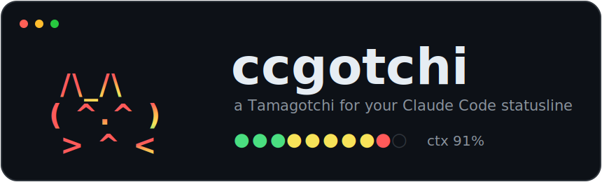
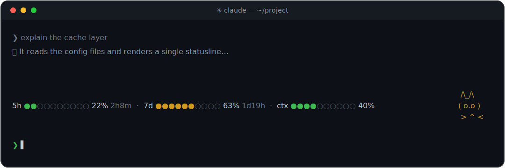

<p align="center">
  
</p>

<p align="center">
  <a href="README.md">English</a> · <a href="README.zh-CN.md">简体中文</a> · <b>日本語</b> · <a href="README.ko.md">한국어</a>
</p>

<p align="center">
  使用量プログレスバーとアニメーションする ASCII <b>ペット</b>付きの <a href="https://docs.claude.com/en/docs/claude-code">Claude Code</a> <b>ステータスライン</b> —— ターミナルの中の小さなたまごっち。
</p>

余裕があるうちはペットは元気ですが、クォータを使い切るにつれて元気がなくなります。18 種類、さらに隠し要素の **✨ シャイニー（虹色）** モード。

<p align="center">
  
</p>

Claude Code がステータスラインコマンドに渡す JSON を読み取り、1 行（または複数行）を出力します。デーモンなし、テレメトリなし —— 小さなバイナリ 1 つだけ。

## 機能

- **5 時間**および **7 日間（週次）**のレート制限ウィンドウ（Pro/Max）の**使用量バー**と、**リセットまでのカウントダウン**。
- **コンテキストウィンドウ**バー（API モードでも動作 —— API モードには 5h/週次ウィンドウがないため、それらのセグメントは自動的に省略されます）。
- **右側に固定されたアニメーションペット**。表情/体力 = `100 − 最も使っているウィンドウ` なので、作業に合わせて目に見えて反応します。まばたきし、口を動かし、毎秒アニメーションします。
- **18 種類**（Claude Buddy のラインナップ）：cat, chonk, rabbit, duck, goose, owl, penguin, turtle, snail, dragon, octopus, axolotl, ghost, robot, blob, cactus, mushroom, capybara。
- **✨ シャイニーモード** —— 文字ごとに流れる虹色（トゥルーカラー）、隠しバリアント。
- **ペットの色を選択** —— 自動（体力に応じて）または固定色（オレンジ、ピンク、青…）。
- **任意のセグメントを表示/非表示** —— 5h / 7d / コンテキストを個別に切り替え。
- **バーのスタイルを変更可能**：ドット / ブロック / シェード / 四角 / スラッシュ / バッテリー、カラーまたはモノクロ。

## インストール

### macOS アプリ（メニューバー常駐）—— おすすめ

アプリをビルドしたら、メニューバーのアイコンをクリックするだけですべて設定できます。コマンドを覚える必要はありません：

```bash
git clone https://github.com/yunyang906/ccgotchi
cd ccgotchi
cargo build --release --workspace
./package_macos.sh
open build/ccgotchi.app
```

起動するとステータスラインが自動的に Claude Code に組み込まれ、🐈 メニューバーアイコンが追加されます。メニューから：ペットを選ぶ、✨ シャイニーを切り替える、バーのスタイル / 色 / 言語を変更 —— 変更は即座に反映されます。「Restore（アンインストール）」で元に戻せます。

### CLI（全プラットフォーム）

```bash
cargo install --git https://github.com/yunyang906/ccgotchi ccgotchi
ccgotchi setup       # ステータスラインを ~/.claude/settings.json に組み込む
ccgotchi restore     # 元に戻す（以前の statusLine を復元）
```

`setup` は次を書き込みます（既存の statusLine はバックアップされます）：

```json
{ "statusLine": { "type": "command", "command": "ccgotchi statusline", "refreshInterval": 1 } }
```

`refreshInterval: 1` により、アイドル時もペットがアニメーションし続けます。新しい Claude Code セッションを開く（または 1 秒待つ）と表示されます。

> ビルド済みのダウンロードは [Releases](https://github.com/yunyang906/ccgotchi/releases) ページにあります：
> - **トレイアプリ** —— `ccgotchi-app-macos-arm64`、`ccgotchi-app-macos-intel`、`ccgotchi-app-windows-x64`
> - **CLI** —— `ccgotchi-cli-macos-arm64`、`ccgotchi-cli-macos-intel`、`ccgotchi-cli-windows-x64`、`ccgotchi-cli-linux-x64`

ダウンロードした macOS アプリは公証（notarize）されていない（有料の Apple Developer 証明書なし）ため、Gatekeeper に*「……は壊れているため開けません」*と表示されます。一度だけ隔離属性を削除してから開いてください：

```bash
xattr -dr com.apple.quarantine /path/to/ccgotchi.app
```

**Windows トレイアプリ:** `ccgotchi-app-windows-x64.zip` をダウンロードして展開し（2 つの `.exe` は同じフォルダに置いたまま）、`ccgotchi-app.exe` を実行します —— トレイアイコンが追加され、Claude Code に自動的に組み込まれます。CLI を使いたい場合、`ccgotchi.exe` はターミナルから実行するコマンドラインツールです（`ccgotchi.exe setup`）。ダブルクリックしないでください —— コンソールが一瞬表示されるだけです（`--help` を出力して終了しただけで、クラッシュではありません）。**Linux** は今のところ CLI のみです。

## 設定

**メニューバーアプリ**でクリック操作するか、CLI から任意の項目を設定できます：

```bash
ccgotchi pet cat            # cat|chonk|rabbit|...|capybara|off（18 種類）
ccgotchi petcolor auto      # auto（体力に応じて）| orange|pink|red|yellow|green|cyan|blue|purple|white|gray
ccgotchi shiny on           # 虹色ペット（on|off）
ccgotchi barstyle dots      # dots|block|shade|square|slant|battery
ccgotchi barcolor auto      # auto（使用量に応じて緑/黄/赤）| mono（モノクロ）
ccgotchi resetfmt eta       # eta | arrow (↻) | paren | cn (余) | off
ccgotchi show ctx off       # セグメントの表示/非表示：5h|7d|ctx （on|off）
ccgotchi lang ja            # en | zh | ja | ko（$LANG から自動検出）
ccgotchi config             # 現在の設定を表示
```

### 国際化（i18n）

セグメントのラベルとトレイメニューはローカライズされます。言語はデフォルトで**システムのロケール**に従います —— OS から直接読み取るため、Finder / エクスプローラーから起動したアプリでも正しく認識されます（CLI は `$LANG` / `$LC_ALL` も参照します）。`ccgotchi lang <code>` でいつでも上書きできます：

| 言語 | 5h ウィンドウ | 7 日間ウィンドウ | コンテキスト |
|------|-----------|--------------|---------|
| `en` | `5h`      | `7d`         | `ctx`   |
| `zh` | `5h`      | `周`         | `上下文` |
| `ja` | `5h`      | `週`         | `文脈`   |
| `ko` | `5h`      | `주`         | `컨텍스트` |

言語の追加は 1 行の PR で完了します：`src/lib.rs` の `labels()` に match アームを追加するだけです。

## ペットの体力

`体力 = 100 − max(5h%, 週次%, コンテキスト%)`：

| 体力 | 気分 | 例 |
|--------|------|---------|
| ≥ 60   | ごきげん | `( ^.^ )` |
| 30–60  | まあまあ | `( o.o )` |
| 10–30  | 元気なし | `( T.T )` |
| < 10   | 瀕死   | `( x.x )` |

## 補足 / 仕組み

- ターミナルの幅は `COLUMNS` 環境変数から取得します。Claude Code はコマンド実行前にこれを設定します（v2.1.153+）。ペットの右寄せはこれを利用しています。
- Claude Code はステータスライン出力の各行の先頭の空白を削除します（[#29206](https://github.com/anthropics/claude-code/issues/29206)）。そのため右寄せのパディングには点字の空白 `U+2800` を使用しています（通常の空白ではなく、削除を生き延び、空白として表示されます）。

## クレジット

[ccstatusline](https://github.com/sirmalloc/ccstatusline)、[ccpet](https://github.com/terryso/ccpet)、および Anthropic の Claude Buddy にインスパイアされています。[ClaudeLight](https://github.com/yunyang906/ClaudeLight) プロジェクト（ハードウェア信号機クライアント）から切り出されました。

## Star 履歴

<a href="https://star-history.com/#yunyang906/ccgotchi&Date">
  
</a>

## ライセンス

MIT —— [LICENSE](LICENSE) を参照。
